# Tilt-a-tron

<p align="center">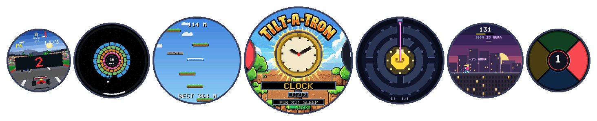</p>

**A pocket-watch game console you tilt, turn and tap.** Open-source firmware for the Waveshare
**ESP32-S3-Touch-AMOLED-1.75** - a 466×466 round AMOLED with touch, a motion sensor and a speaker -
plus ten games made for a round screen, a desktop app to manage them, and an API for writing
your own.

- **Install it from a web page** in about a minute: <https://partiallyfrozen.github.io/tilt-a-tron/>
- **Every game is a file.** Install, remove and trade `.tat` packages; no firmware build needed.
- **Write a game in plain C** against one header, pack it with one script, drop it on a running watch.
- MIT licensed. Building for it, or porting it to another board, is meant to be easy:
  [CONTRIBUTING.md](CONTRIBUTING.md) · [docs/GAME_API.md](docs/GAME_API.md)

## The games

<table>
<tr>
<td align="center" width="20%">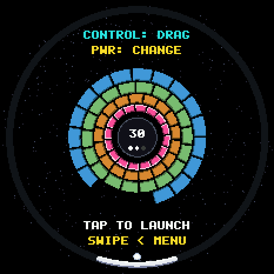<br><b>BREAKOUT</b><br><sub>Rings of bricks. Turn the watch like a wheel; the paddle stays at the bottom.</sub></td>
<td align="center" width="20%">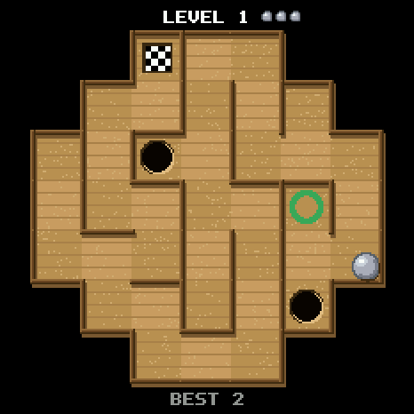<br><b>MARBLE MAZE</b><br><sub>Tilt a steel ball through generated mazes. Mind the holes.</sub></td>
<td align="center" width="20%">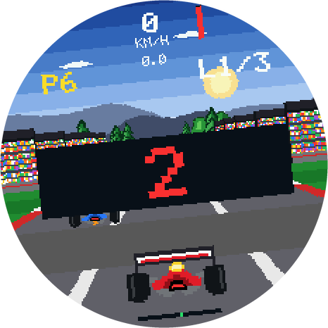<br><b>GRAND PRIX</b><br><sub>The whole watch is the steering wheel. Tip forward for throttle.</sub></td>
<td align="center" width="20%">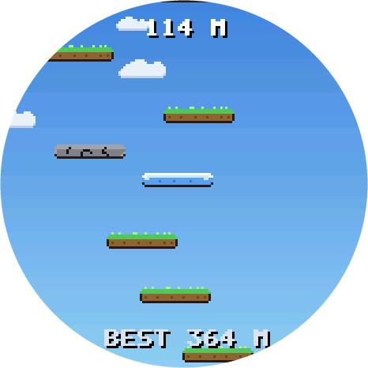<br><b>SKY JUMP</b><br><sub>Tilt Hopper up an endless tower, from morning sky to the stars.</sub></td>
<td align="center" width="20%">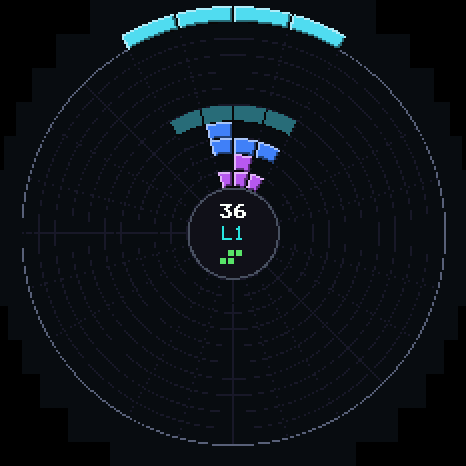<br><b>TILT-A-TRIS</b><br><sub>Radial block-stacking. You turn the pile under the falling piece.</sub></td>
</tr>
<tr>
<td align="center">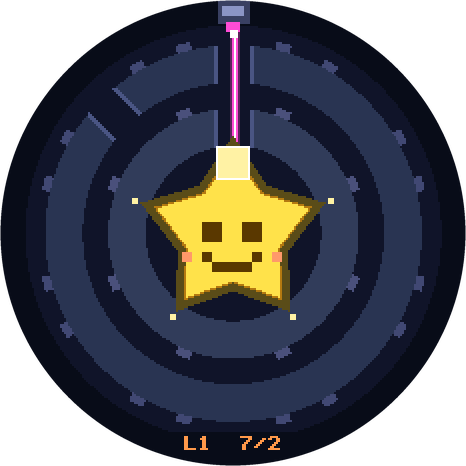<br><b>SLEEPY STAR</b><br><sub>A laser falls straight down. Turn rings of gaps and mirrors to wake the star.</sub></td>
<td align="center">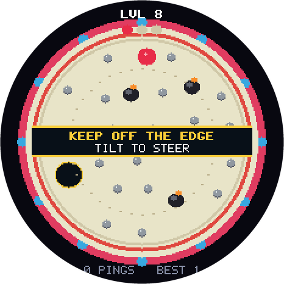<br><b>PIN DROP</b><br><sub>Steer a falling ball through the pins into the hole. The rim is live.</sub></td>
<td align="center">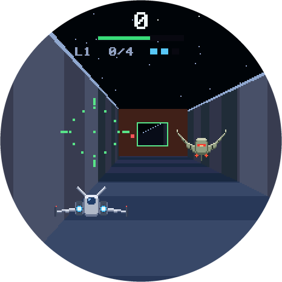<br><b>STARFALL</b><br><sub>A run down a shaft seen head on. Find the gap in every ring; shoot the mines.</sub></td>
<td align="center">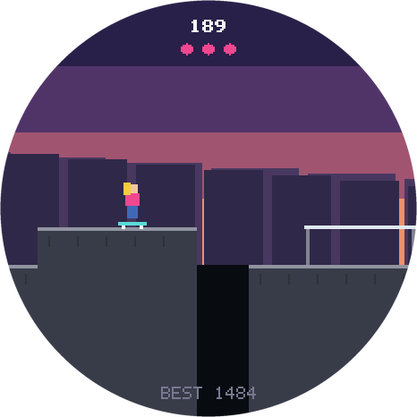<br><b>SKATER GIRLZ</b><br><sub>An endless rooftop skate run. Tip to push, tap to ollie, grind the rails.</sub></td>
<td align="center">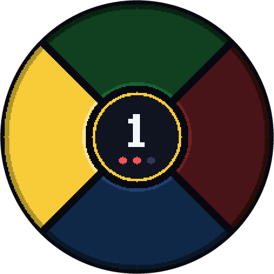<br><b>ECHO</b><br><sub>Watch the pads light up, then touch them in the same order. One more each round, for as long as you can remember.</sub></td>
</tr>
</table>

Plus **Pocket Watch**, a clock with five faces, network time and automatic time zone - the
one app that is part of the firmware rather than a package.

<p align="center">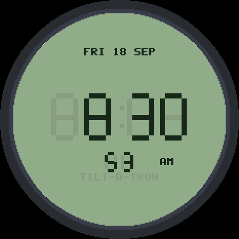</p>

## Install (no toolchain needed)

**Easiest: the browser installer at <https://partiallyfrozen.github.io/tilt-a-tron/>.** Plug the
watch in, open the page in Chrome or Edge on a desktop, press FLASH. The first start takes about
half a minute longer than later ones: the watch shows SETTING UP while it installs its games.
(The page lives in `site/` and is deployed by `.github/workflows/pages.yml`.)

Or from a clone of this repository, which ships the built firmware in `firmware/`. You need
Python 3 and a USB cable that carries data.

```powershell
git clone https://github.com/PartiallyFrozen/tilt-a-tron.git
cd tilt-a-tron
.\install.ps1          # Windows          (macOS / Linux: ./install.sh)
```

The script installs `esptool` the first time, then asks you to put the watch in
install mode: unplug it, hold the small **BOOT** button by the USB port, plug it
in, let go after 2 seconds. It writes the bootloader, partition table and app
(about 15 s), and the watch restarts into Tilt-a-tron. `-Erase` wipes everything
first (settings, Wi-Fi, themes, games). After that, updates can go over Wi-Fi.

Maintainers: after building, `.\tools\make_release.ps1` refreshes `firmware/` and
`site/firmware/` (binaries plus manifests with offsets and the build hash) so both
installers match the source.

## The manager app

<p align="center">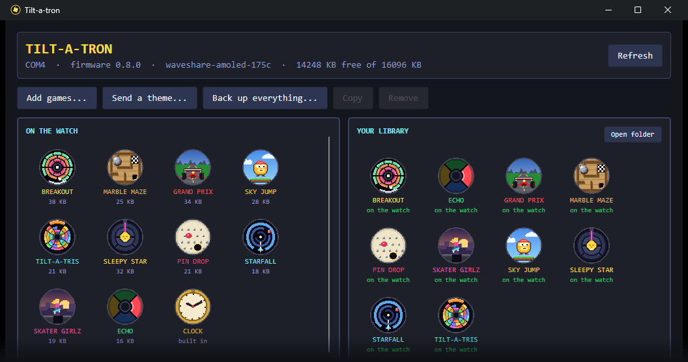</p>

**[Download it from the latest release](https://github.com/PartiallyFrozen/tilt-a-tron/releases/latest)** - Windows, macOS and Linux, one self-contained
file each, nothing to install. It is a desktop app (`app/`, C# and Avalonia) that talks to the
watch over USB. The watch is on the left and **your library** is on the right:
a plain folder of `.tat` files in your documents. Drag a game from one to the other, or drop
`.tat` files in from anywhere.

- **Nothing is lost on the first click.** Taking a game off the watch *moves* it to the
  library, and the copy is read back from disk before the watch's file is deleted. A theme is
  copied out before it is removed. Deleting from the library itself asks twice.
- **Installs and removals show up on the watch straight away** - no restart.
- **Saves survive.** Scores live in the watch's settings store under the game's id, so a game
  that goes to the library and comes back finds them where it left them.
- The same binary is a command-line tool (`list`, `library`, `install`, `save`, `uninstall`,
  ...), which is how all of this is tested against real hardware. See [app/README.md](app/README.md).

## Write a game

No game is compiled into the firmware - not even ours. They live in `games/<id>/` and are
built by the same tool you would use:

```
games/mygame/
  game.json       id, name, author, version, accent colour
  mygame.c        plain C, including only "tat/tat_api.h"
  icon.png        210 x 210, required (a home screen of blank cartridges helps nobody)
  assets/*.png    sprite sheets, if you have any
```

```bash
python tools/mktat.py games/mygame          # -> build/mygame.tat
tiltatron-manager install build/mygame.tat  # onto a running watch; it appears on the home screen
```

A game gets one pointer to a table of functions - a pixel canvas, sprites, tilt and touch,
tones, saves, the shared pause menu - and calls nothing in the console by name, which is what
lets a package built today run on next year's firmware. It is loaded when its icon is tapped,
never at boot, so a bad package costs a message on screen and nothing else. Read
[docs/GAME_API.md](docs/GAME_API.md), then read `games/echo/echo.c`: it is the newest game,
about 450 lines, and was written, installed and revised on a running watch without the
firmware being touched.

The firmware build packs the games in `games/` too (`components/factory`) and carries a
factory copy of each, which it installs the first time it starts - or whenever it finds the
games folder empty, because storage can be wiped and a console with nothing on it is a poor
thing to hand someone. A game you removed stays removed.

## Build & install (developers)

Needs ESP-IDF 5.5.5 (`C:\Espressif`, installed with EIM). One command:

```powershell
.\update.ps1            # build, install, verify
.\update.ps1 -NoBuild   # install the last build
.\update.ps1 -Status    # what the watch is running
.\update.ps1 -Log       # the watch's recent log, over Wi-Fi
```

It installs over **Wi-Fi** if the watch answers (about 5 s; needs Settings > WI-FI ON),
otherwise over **USB** if it's plugged in, and says what to do if it can't reach the watch.
If something on your computer has to get out of the way of the serial port first, put it in
`update.local.ps1`, which is run before a USB flash and is not part of the repository.

**Verification uses the build's unique hash** (`sha` in `/status`, the ELF SHA-256),
compared with the file that was sent. Don't use the `built` timestamp: it only
changes when that one source file is recompiled, so it stays the same across
incremental builds.

Recovery, in order of escalation:
- A build that crashes 3 boots in a row drops into **safe mode**: themes, sound and
  storage are skipped, Wi-Fi is forced on, and the update screen waits for a fix.
- A crash during sound start-up skips sound on the next boot.
- New firmware goes into the idle app slot; if it can't even bring the screen up,
  the bootloader rolls back to the previous build.
- Always works: unplug, hold **BOOT**, plug in, release after 2 s, then `.\update.ps1 -Usb`.

The watch serves `GET /status`, `GET /log`, `GET /reboot` and `POST /update` on port 80
whenever it's on Wi-Fi. Set up the network once in **Settings > NETWORK**. `idf.ps1`
wraps `idf.py` with the ESP-IDF 5.5.5 environment (`C:\Espressif`), e.g.
`.\idf.ps1 -p COM4 monitor`.

## Layout

| Path | What |
| --- | --- |
| `components/board` | Hardware layer (C): QSPI display + TE vsync, touch, IMU, buttons, pin map |
| `components/engine` | Engine (C++): `Gfx` renderer, `Presenter` frame pipeline, `Input` (debounce, click/long press), `Gestures`, `Polar`, `Engine` loop + app switching |
| `components/wc_console` | Console shell: `Launcher` carousel, `SettingsApp`, `UpdateApp` (Wi-Fi setup + OTA), shared `ui.h` widgets, app icons |
| `components/storage` | 16 MB FAT at `/data` for themes and game data; seeds `Theme/Default`. Only the watch touches it |
| `components/lodepng` | PNG decoder for themes (zlib license) |
| `themes/` | Source of the built-in Default theme (embedded in firmware, written to storage on first boot) |
| `tools/make_default_theme.py` | Regenerates `themes/Default` PNGs |
| `tools/tatlink.py` | Reference client for the USB link: list, send and fetch files, back up, format |
| `components/net` | Wi-Fi join/scan, saved credentials, OTA HTTP server, update-mode flag |
| `games/<id>/` | **The games.** Each is plain C against `tat_api.h` alone, with its art, icon and `game.json`; built into a `.tat` package by `tools/mktat.py` |
| `components/tat_api` | The contract between the console and a game, and the console's side of it |
| `components/loader` | Reads a package, checks it, relocates its code into PSRAM and runs it. One game is resident at a time: opening another lets go of the last, along with everything it allocated |
| `components/factory` | Packs `games/` during the firmware build and carries a factory copy of each, installed on first start |
| `components/games` | The one app that is part of the firmware: Pocket Watch, which needs the real-time clock, time zones and network time - none of which a game is given |
| `app/` | The desktop manager app and its library (C#, Avalonia) |
| `components/link` | The USB link: the framed protocol over the serial port that the manager app speaks (`docs/GAME_API.md`) |
| `components/audio` | Chiptune synth through the ES8311 codec |
| `main/` | App registry (carousel order) + `BenchGame` bring-up/calibration app |
| `docs/` | Board schematic, `GAME_API.md` (the OS/packages design), `SLEEPY_STAR_SPEC.md` |

## Themes

Ready-made themes live in `themes/` (BeachVibez, CPU, SkaterGirl, Spaceportal,
Tiltatron-8bit): send a folder to the watch's `Theme` folder and pick it in
Settings > THEME. `Default` is built into the firmware.


Themes are plain files in the watch's storage, so anyone can make one:

```
README.txt            what each file is
Guide/                design templates (where icons/rows/titles land)
  guide-home.png      home screen zones, 466x466
  guide-menus.png     settings / pause menu zones
  guide-icon.png      one app icon, 210x210
Theme/
  Default/            built-in look, written on first boot
    theme.json        colors: background text label dim panel box value accent go danger
    background.png    466x466 (any PNG in the folder works), behind home + menus
    icons/<app>.png   210x210 app icons (breakout.png, settings.png)
  My Theme/           any folder you add is a theme
```

Menu rows and buttons are filled with the theme's `panel` color and text on the
background gets a drop shadow, so busy artwork stays readable. Oversized images
are shrunk to fit (up to ~1264x1264); `tools/make_guides.py` regenerates the templates.

- **Send one to the watch** over USB, with it plugged in and awake:

  ```bash
  python tools/tatlink.py --send "themes/BeachVibez" "Theme/BeachVibez"
  ```

  The console notices and reloads on its own; no restart, no ejecting, nothing to switch
  on first. `--ls` shows what is there and `--backup` copies it all back to your computer.
- **Settings → THEME** cycles through the folders.
- Missing files fall back to the built-in look. PNGs are decoded once at load
  (~300 ms) into RGB565 + alpha; drawing is straight copies.
- The watch is never handed its filesystem as a USB drive. That is deliberate: it used to
  be, and a restart while Windows still had it mounted cost a set of themes.
- `themes/README.txt` documents the sizes for theme makers.

## Console navigation

- **Home** is a carousel: swipe (or tap beside the icon) to browse, tap the icon to launch; PWR does nothing on its own here.
- **Double-click PWR** on home = sleep (iris-out, light sleep, PWR wakes instantly where
  you left off). Still asleep after **AUTO OFF** (default 2 min) → powers down (deep
  sleep); PWR then cold-boots into the carousel. **On USB power it naps instead**: screen
  and motion sensor off, everything else left running, until PWR. Light sleep does not hold
  with a cable in, and an AMOLED left lit on its charger all night is the thing to avoid.
- **Idle auto off**: no buttons, touch or deliberate motion for the AUTO OFF time (and
  no app keeping it awake via `Game::keepAwake()`, e.g. a ball in play or a firmware
  download) → the screen dims for 10 s, then powers down. Any touch cancels.
- **BOOT** (the small key by the USB port) returns home from any app (handled by the engine).
- **Settings** (scrollable): brightness · theme · Wi-Fi on/off · network (scan + on-screen
  keyboard) · auto off (1/2/5/10 min/never) · games · calibrate · update · version.
- Wi-Fi is **off by default**. When on, it connects in the background at boot with
  modem power-save and reconnects with backoff; games keep running on core 1.

### Settings worth knowing

- **GAMES**: take any app off the home screen (HIDDEN) or put it back (ON). Nothing is deleted;
  the app and its saves come back when you turn it on again. Removing a game for real is the
  manager app's job, and it keeps a copy
- **CALIBRATE**: a one-minute walkthrough (lay it flat, spin it half a turn, check the bubble
  level) that measures this watch's motion sensor at rest and corrects every game's tilt
- The watch never dozes off while something is talking to it over Wi-Fi: it stays awake during
  an update or upload and for two minutes after any request to its web server

## Shared console UX

All apps follow the same conventions (use `console::ui` and `wc::Gestures`):
bold text at scale 2 or larger; tap is the primary action; BOOT = home; PWR click
= the app's secondary action (Breakout: change control); hold PWR is reserved
(sleep/power later); PWR double-click on home = sleep; swipe left = the app's menu,
swipe right = back; long menus use `console::ui::ScrollList`; tooltips explain
controls before play starts.
Default to what's fun on a watch you hold: tilt, gravity, momentum, juice.

## How frames stay fast

- **Core 1** runs `Game::update()` + `Game::draw()` into a PSRAM framebuffer.
- Every draw call marks 16-px **dirty bands**. `present()` sends only dirty pixels,
  clipped to the round visible area, merged into a few rectangles.
- Dirty pixels are copied into a pool of internal **DMA buffers** and queued to a
  **core 0** task that waits for the panel's **TE (vsync) edge** and streams them.
  Canvas games skip the framebuffer: their bands are generated straight into the
  DMA buffers (each just under the 32 KB single-transfer limit, and only as wide
  as the round panel is at that height), so a whole frame is on the wire in ~14 ms.
- At most **one frame is in flight**: `present()` blocks until the previous frame
  starts transmitting, so every frame is rendered from fresh input (~1 frame latency).
- Input is sampled on core 0 independently of frame rate: buttons 500 Hz, IMU 250 Hz,
  touch on interrupt. Edges between frames are latched so quick taps are never lost.
- Wi-Fi is off unless the user enables it; its code/zeroed data live in PSRAM/flash
  (`ESP_WIFI_IRAM_OPT` off, `SPIRAM_ALLOW_BSS_SEG_EXTERNAL_MEMORY`) so internal RAM
  stays free for display DMA buffers.

## How games draw

### Pixel canvas and sprite sheets

Games draw on a `wc::Canvas`: a small 8-bit palette picture (233x233 at 2x or
155x155 at 3x, in PSRAM) that the presenter scales straight into the display's DMA
bands, skipping the 466x466 framebuffer entirely. A full redraw costs well under a
millisecond, so games repaint every frame and run at the display's 60 Hz limit;
`presentRotated()` rotates the canvas on the way out (Grand Prix). Palette entries
can change per frame for free (sky gradients, tints).

Sprites are plain PNGs under `games/<game>/assets/`, packed into the game's `.tat` by
`tools/mktat.py` and loaded with `sheet_load(canvas, png, len, fw, fh)`
(frames side by side, alpha < 128 = transparent). Edit them in any image editor;
`tools/make_sprites.py` regenerates the originals from letter grids and
`tools/preview_sheets.py <game>` tiles them for a look. `Polar` (per-pixel
angle/radius tables) is still there for round layouts like Breakout's rings.

### Seeing the watch from the PC

With Wi-Fi on, `GET /screen` returns a PNG of the display (works for canvas games
too) and `GET /input?...` drives it: `app=N` (0 = home), `tap=x,y`,
`swipe=x0,y0,x1,y1`, `hold=x,y,ms`, `btn=a|b[,ms]`, `tilt=ax,ay,az` or `tilt=off`.
Handy for checking a game without picking the watch up.

## Breakout controls

- **Tilt** (default): the paddle is locked to real-world "down". Turn the watch like
  a wheel and the paddle stays at the bottom while the rings rotate around it
- **Tap** to launch / restart · **PWR** cycles control: tilt → drag → follow · **BOOT** home
- **Swipe left** pauses (control, tilt direction, speed, home); saved to NVS

## Marble Maze controls

- **Tap** to start: however you're holding the watch at that moment becomes "level"
- **Tilt** rolls the ball; reach the checkered flag. Holes wait at the end of wrong turns
- Mazes are generated each level (7x7 up to 13x13, clipped to the round board), with start
  and finish at the two ends of the longest route; more dead ends get holes as levels climb
- **Swipe left** pauses (recenter tilt, sound, best level, home) · **BOOT** home
- 3 balls per run; best level reached is saved

## Grand Prix controls

- The picture stays upright; the whole watch is the steering wheel. Twist to steer
- **Tilt forward** for throttle, **back** to brake (sensitivity or OFF in the menu)
- **Touch** pauses · **Swipe left** menu (steering, tilt speed, sound, restart) · **BOOT** home
- Three laps against five rivals; the pseudo-3D road is drawn upright into a 256x256
  buffer and rotated by the device's roll straight into the display bands

## Sky Jump controls

- **Tilt** left/right to steer Hopper; the screen wraps at the edges
- **Tap** to start, **tap or hold** to shoot straight up
- Green ledges bounce, blue ones slide, brown ones crumble, red springs launch you
- Stomp monsters from above or shoot them; touching one from the side ends the run
- The sky turns to stars as you climb. **Swipe left** menu (tilt sensitivity, sound,
  new game, best) · **BOOT** home. Best height is saved

## Tilt-a-tris controls

- Radial Tetris: wedge pieces fall inward from the rim; fill a whole ring to clear it
- The pile is locked to the real world: **turn the watch** to spin the pile under the
  falling piece, which stays at the top of the screen
- **Tap** rotates the piece · **hold** soft-drops · **PWR** hard-drops
- Some level-ups flip gravity: pieces rise from the core and the pile builds against
  the rim, until the next flip
- Score, level and the next piece live in the core. **Swipe left** menu (sound, new
  game, best) · **BOOT** home. Best score is saved

## Sleepy Star controls

- A laser always falls straight down; rings of walls with gaps, mirrors and splitters sit
  between it and a sleeping star. **Turn the watch** and the emitter moves round the rim to
  real-world "up" (free, 8 notches); **tap a ring** to click it one notch, and the ring inside
  it turns the other way. Get the light through the star's door
- Only taps are counted, against each level's verified best (3 stars at best, 2 within two,
  1 for any solve). Six hand-made levels at 1, 2, 4, 7, 11, 16; every other level is generated
  on the watch from its number (the same for everybody) and solved by breadth-first search
- **PWR** or the RST button starts the level over · **swipe left** menu (level, sound,
  flat play with the gyro, reset) · built from `docs/SLEEPY_STAR_SPEC.md`

## Pin Drop controls

- A ball falls through a field of pins; **turn the watch** and gravity follows the real world,
  exactly like tilting a board in your hands. Steer it into the one hole
- The rim is live: touch it and the ball is gone. A round board has no safe corner
- Later levels put bombs on the field. **Swipe left** menu · **BOOT** home. Progress is saved

## Starfall controls

- The shaft is seen head on: the middle of the screen is far away and the rim is right in
  front of you. Barriers come as rings with one gap each
- **Turn the watch** to move your ship round the rim into the gap · **tap** to shoot the mines
- **Swipe left** menu (sound, new run, best) · **BOOT** home. Best score is saved

## Skater Girlz controls

- A side-on rooftop skate run that never ends and never repeats
- **Tip forward** to push, **tip back** to slow · **tap** to ollie, **hold** for more air ·
  land on a rail from above to grind it
- Miss a gap and the run is over; clip a bin and you lose your speed, which costs more than
  it sounds like. **Swipe left** menu · **BOOT** home. Best distance is saved

## Echo controls

- Four pads. The watch plays a pattern - WATCH - and then it is YOUR GO: **touch the pads**
  in the same order. A pad stays lit for as long as your finger is on it, like a real button
- Get it right and the pads cheer, then the pattern grows by one. It gets quicker every four
  rounds, and there is no last round: it goes on for as long as you can remember it
- Touch a wrong pad, or take longer than five beats of the pattern over one, and you lose;
  the round you reached is your score
- That is all of it, on purpose: the one game here that does not use tilt. A first version
  pressed pads by tipping the watch toward them, and it was clever and no fun
- **Swipe left** menu (sound, new game, best) · **BOOT** home. Best round is saved

## Pocket Watch (Clock)

- Five faces, **tap** to cycle: Pocket (brass, numerals, sweeping seconds, date window),
  Retro LCD (seven-segment digits, day and date), Hopper Sky (sky and sun/moon follow
  the time of day, Hopper hops every second), Tacho (minutes on a rev counter, hours
  on a small dial) and Rings (Tilt-a-tris wedges fill for seconds, minutes, hours)
- Time syncs from NTP whenever Wi-Fi is on; otherwise **swipe left** > SET TIME
- Menu: FACE · 12H/24H · TIME ZONE (whole hours from UTC) · SET TIME

## Bench app

Hold BOOT as the screen turns on. **Tilt** rolls the ball, **touch** drags the dot,
**BOOT** toggles vsync, **PWR** toggles a full-screen stress test.

## Roadmap

- Watch faces and themes as packages, in the same `.tat` container as games
- A way to remove a game on the watch itself, without the app
- Game store (way later): download the same `.tat` files over Wi-Fi instead of copying them
  over USB. Groundwork in place: packages, the loader, background Wi-Fi, OTA slots.
- Known and unsolved: the watch sends slowly over Wi-Fi (5-15 KB/s) and receives slowly over
  USB (~9 KB/s). Neither gets in the way of playing; both are worth someone's afternoon.

## Licence

MIT - see [LICENSE](LICENSE). Use it, change it, sell what you make with it; just keep the
copyright notice.
